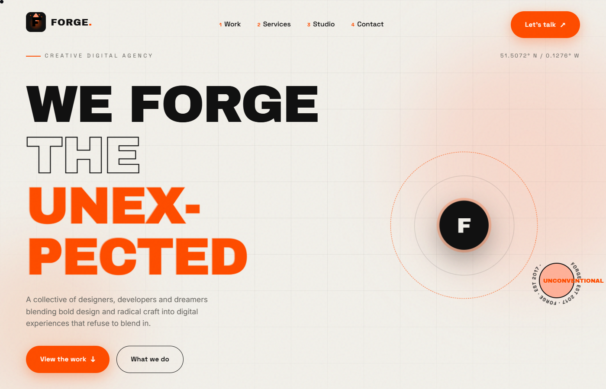
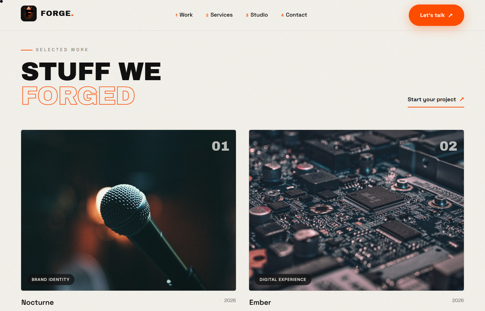
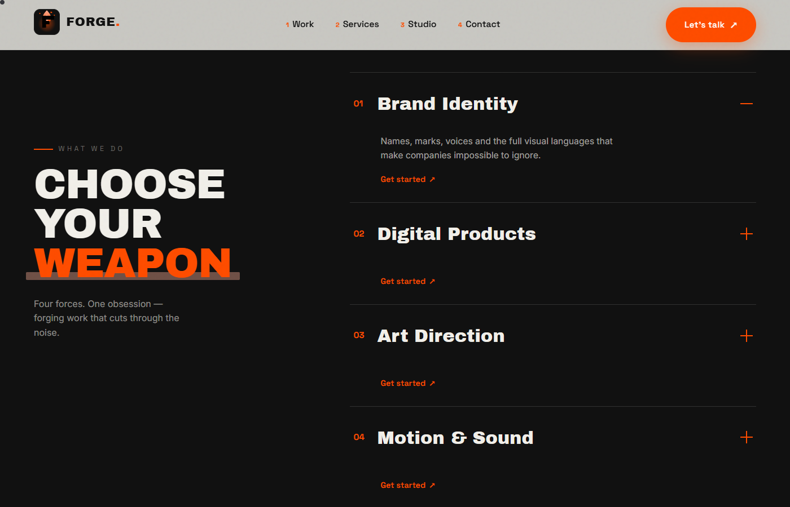
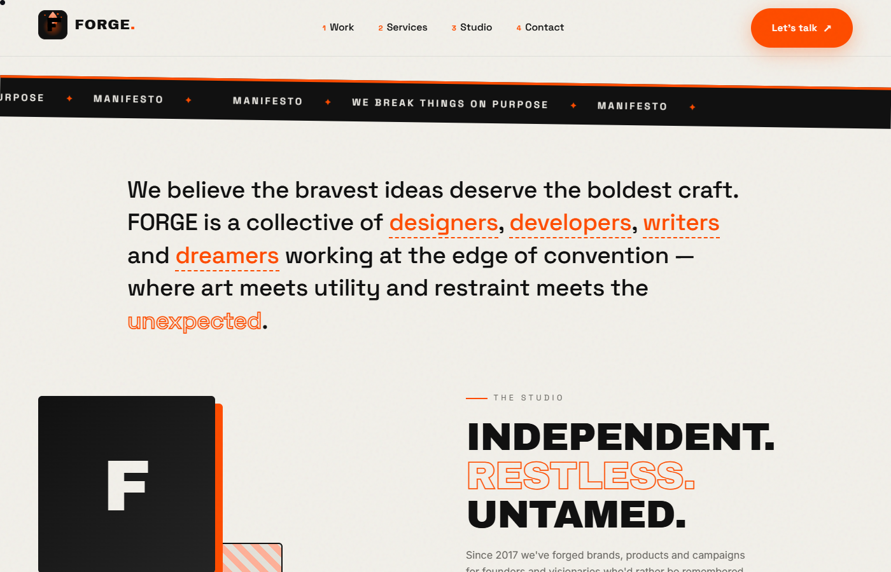
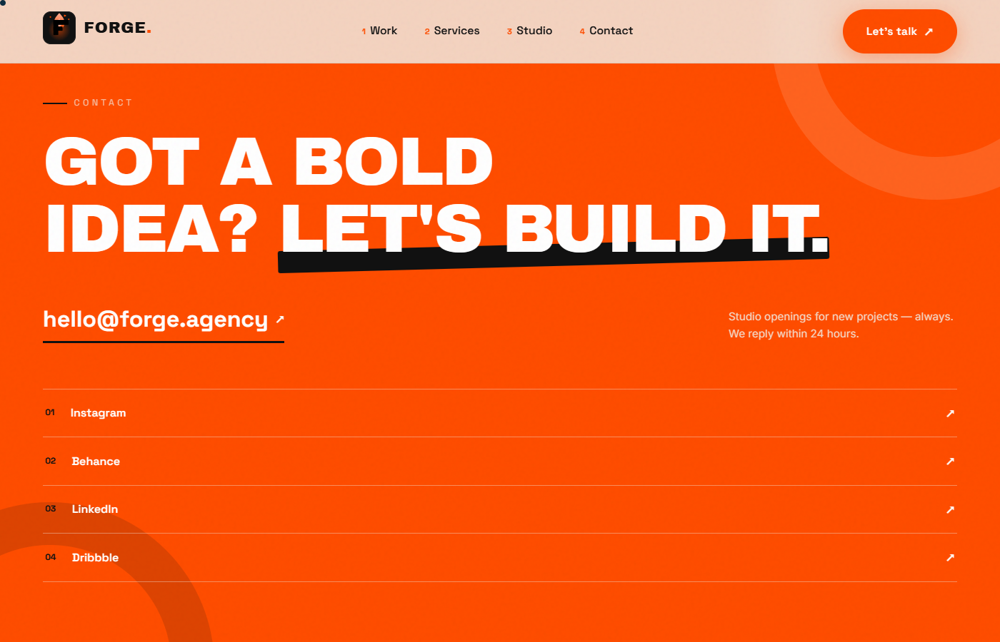

# FORGE

Landing page for a fictional creative digital agency. Built as a portfolio piece.

React, Vite, hand-crafted CSS. No UI framework — the colour palette comes from the FORGE brand system.

Live site: **https://forge-six-kohl.vercel.app/**

## Screenshots











## Run it

```sh
npm install
npm run dev
```

Build for production with `npm run build` (`dist/`), preview with `npm run preview`.

## Structure

- `src/data/content.js` — all the copy (projects, services, nav links, stats). Editing text is a one-file job.
- `src/components/` — one component per section, plus the `Logo` emblem and `Loader`.
- `src/styles/` — one CSS file per component; `src/index.css` holds the design tokens and shared bits.
- `src/hooks/useEffects.js` — the two small pieces that make it move: scroll reveal and the custom cursor.

## Palette

Defined once as CSS variables in `src/index.css` and referenced everywhere. No stray hex values.

| Role | Hex |
|---|---|
| Primary | `#111111` |
| Secondary | `#242424` |
| Background | `#F2F0EA` |
| Surface | `#E4E1D9` |
| Text | `#111111` |
| Muted | `#696762` |
| Accent | `#FF4D00` |
| Accent light | `#FFB199` |

## Known rough edges

- Images are hotlinks-turned-local downloads from Unsplash. I couldn't preview them visually, so they're matched by subject (vinyl → music label, circuit board → fintech, etc.) — worth a second look and easy swaps before deploying anywhere serious.
- The loader blocks the page for ~1.7s with fake progress. It's purely cosmetic drama; nothing actually loads that long.
- The custom cursor is `mix-blend-mode: difference` and hides itself on touch devices, but won't match your OS cursor size — some people find that annoying.
- Privacy: `dist/` is gitignored, so no build output is under version control.
- The contact form / social links go nowhere real yet — the mailto is the only live action.
